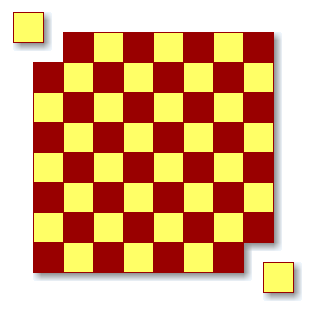

Cracking the coding interview--Q6.1~Q6.6
Hawstein | January 5, 2013

## 题目6.1

原文：

Add arithmetic operators (plus, minus, times, divide) to make the following expression true: 3 1 3 6 = 8. You can use any parentheses you’d like.

解答6.1
简单题，就不翻译了。答案：(3 + 1) / (3 / 6) = 8.

## 题目6.2

原文：

There is an 8x8 chess board in which two diagonally opposite corners have been cut off. You are given 31 dominos, and a single domino can cover exactly two squares.Can you use the 31 dominos to cover the entire board? Prove your answer (by providing an example, or showing why it’s impossible).

译文：

有一个8x8的国际象棋棋盘，对角线两端的方格被去掉了。你有31个多米诺骨牌， 每个骨牌能覆盖棋盘上两个方格。你能用31个多米诺骨牌覆盖整个棋盘吗( 不包含去掉的2个方格)。如果能，请给出覆盖方案；如果不能，请说明为什么。

解答6.2
这是一道非常经典的问题，详情见：Mutilated chessboard problem。 这道题目的答案是不能。为什么呢？先让我们来看看下面的图。



如果不去掉对角的两个方格，我们可以用32个多米诺骨牌把棋盘完全覆盖， 每个骨牌覆盖两个方格，共覆盖了32*2=64个方格。并且， 每个骨牌正好覆盖一个红色方格和一个黄色方格。也就是，我每往棋盘上放一个骨牌， 棋盘上就少掉一个红色方格和一个黄色方格，这是一个必然事件。那么， 当对角的两个黄色方格被去掉后，剩下32个红色方格和30个黄色方格。 我每放一个骨牌还是会覆盖掉一个红色方格和一个黄色方格，最后的情况是， 剩下2个红色方格。从棋盘上可以看出，任意两个红色方格都无法用一个骨牌覆盖， 因此，这道题目的答案是不能用31个多米诺骨牌将去掉两个角的棋盘覆盖。

这道题目的关键就是棋盘的着色，如果你画一个8x8的白色棋盘， 也许会很茫然的不知如何下手。这道题目推广一下，可以得到以下结论： 从棋盘上任意去掉两个方格，如果去掉方格的颜色是一样的，那么， 我们无法用31个多米诺骨牌将剩余的方格覆盖；如果去掉的方格的颜色是不一样的， 那么，我们一定可以用31个多米诺骨牌将剩余的方格覆盖。

## 题目6.3

原文：

You have a five quart jug and a three quart jug, and an unlimited supply of water(but no measuring cups). How would you come up with exactly four quarts of water? NOTE: The jugs are oddly shaped, such that filling up exactly ‘half’ of the jug would be impossible.

译文：

大意就是：你有两个瓶子，一个可以装5升水，一个可以装3升水， 怎样利用这两个瓶子量出4升水来。

解答6.3
简单题。先装满5升水，倒到3升的瓶子里，5升的瓶子中剩余2升水；再把3升的瓶子倒空， 把5升瓶子里的2升水倒到3升的瓶子里，3升瓶子还可装1升水；最后装潢5升水， 往3升瓶子里倒，当3升瓶子满时，5升瓶子里就正好装了4升水。

## 题目6.4

原文：

A bunch of men are on an island. A genie comes down and gathers everyone together and places a magical hat on some people’s heads ( i.e., at least one person has a hat). The hat is magical: it can be seen by other people, but not by the wearer of the hat himself. To remove the hat, those (and only those who have a hat) must dunk themselves underwater at exactly midnight. If there are n people and c hats, how long does it take the men to remove the hats? The men cannot tell each other (in any way) that they have a hat.

FOLLOW UP

Prove that your solution is correct.

译文：

在一个岛上有一群人，他们中有些人的头上被戴上了一顶神奇的帽子(至少有一人戴了帽子)， 这顶帽子别人看得到，但戴帽子的人自己看不到。想要去掉这顶帽子， 需要戴着帽子的本人在正好午夜的时候，把自己泡在水里。如果有n个人，c个帽子， 需要多长的时间才能把所有的帽子都摘除。注： 这群人不能相互告诉对方他们的头上是否有帽子。

解答6.4
也是被问烂的智力题之一了吧。与它类似的一个题目是：村庄里有几条病狗？ 这类题目的一个前提是题中的人都要非常聪明，懂推理。不然，题目就没有任何意义了。 这类题目都是从一个条件的最基本情况出发，然后得出规律。比如这道题， 假如只有一个帽子，那么戴着帽子的那个人出去一看，另外n-1个人都没有帽子， 而题目已经说了，至少有一个人是戴着帽子的，所以可以推断唯一一个戴着帽子的就是自己， 于是他会在第1天的午夜泡到水里，去掉头上的帽子。如果有2个帽子， 比如说是A和B戴着，A第1天发现B是戴着帽子的，而A又不知道一共有多少个帽子， 所以他无法判断自己头上是否戴了帽子，因此A第1天什么也不做。同理，B也一样。 到了第二天，A发现B还戴着他的帽子，这就说明了至少要有2顶帽子。否则如果只有一顶， B能推理出来，并且在第一天午夜就去掉它了。如果至少有2顶，B已经戴了一顶， 那么另一顶就在自己(A)头上了，所以A在第2天的午夜去掉了帽子。同理， B也做出了同样的推理，在第2天午夜去掉了帽子。

从以上的分析我们马上可以得出，如果有c个帽子， 那么需要c天的时间才能把所有的帽子去掉，而且这c个人都是在第c天的午夜才摘除帽子的。

## 题目6.5

原文：

There is a building of 100 floors. If an egg drops from the Nth floor or above it will break. If it’s dropped from any floor below, it will not break. You’re given 2 eggs. Find N, while minimizing the number of drops for the worst case.

译文：

有一栋楼共100层，一个鸡蛋从第N层及以上的楼层落下来会摔破， 在第N层以下的楼层落下不会摔破。给你2个鸡蛋，设计方案找出N，并且保证在最坏情况下， 最小化鸡蛋下落的次数。

解答6.5
我们先假设最坏情况下，鸡蛋下落次数为x，即我们为了找出N，一共用鸡蛋做了x次的实验。 那么，我们第一次应该在哪层楼往下扔鸡蛋呢？先让我们假设第一次是在第y层楼扔的鸡蛋， 如果第一个鸡蛋在第一次扔就碎了，我们就只剩下一个鸡蛋，要用它准确地找出N， 只能从第一层向上，一层一层的往上测试，直到它摔坏为止，答案就出来了。 由于第一个鸡蛋在第y层就摔破了， 所以最坏的情况是第二个鸡蛋要把第1到第y-1层的楼都测试一遍，最后得出结果， 噢，原来鸡蛋在第y-1层才能摔破(或是在第y-1层仍没摔破，答案就是第y层。) 这样一来测试次数是1+(y-1)=x，即第一次测试要在第x层。OK， 那如果第一次测试鸡蛋没摔破呢，那N肯定要比x大，要继续往上找，需要在哪一层扔呢？ 我们可以模仿前面的操作，如果第一个鸡蛋在第二次测试中摔破了， 那么第二个鸡蛋的测试次数就只剩下x-2次了(第一个鸡蛋已经用了2次)。 这样一来，第二次扔鸡蛋的楼层和第一次扔鸡蛋的楼层之间就隔着x-2层。 我们再回过头来看一看，第一次扔鸡蛋的楼层在第x层，第1层到第x层间共x层； 第1次扔鸡蛋的楼层到第2次扔鸡蛋的楼层间共有x-1层(包含第2次扔鸡蛋的那一层)， 同理继续往下，我们可以得出，第2次扔鸡蛋的楼层到第3次扔鸡蛋的楼层间共有x-2层， ……最后把这些互不包含的区间数加起来，应该大于等于总共的楼层数量100，即

```c
x + (x-1) + (x-2) + ... + 1 >= 100
(x+1)*x/2 >= 100
```

得出答案是14。

即我先用第1个鸡蛋在以下序列表示的楼层数不断地向上测试，直到它摔破。 再用第2个鸡蛋从上一个没摔破的序列数的下一层开始，向上测试， 即可保证在最坏情况下也只需要测试14次，就能用2个鸡蛋找出从哪一层开始， 往下扔鸡蛋，鸡蛋就会摔破。

1
14, 27, 39, 50, 60, 69, 77, 84, 90, 95, 99, 100
比如，我第1个鸡蛋是在第77层摔破的，那么我第2个鸡蛋就从第70层开始，向上测试， 第二个鸡蛋最多只需要测试7次(70,71,72,73,74,75,76)，加上第1个鸡蛋测试的 7次(14,27,39,50,60,69,77)，最坏情况只需要测试14次即可得出答案。

这个问题还有一个泛化的版本，即d层楼，e个鸡蛋，然后设计方案找出N， 使最坏情况下测试的次数最少。维基上给出了DP的解法，感兴趣的话也可以看看以下链接： 在第12章有比较详细的介绍。

The puzzle of eggs and floors

## 题目6.6

原文：

There are one hundred closed lockers in a hallway. A man begins by opening all one hundred lockers. Next, he closes every second locker. Then he goes to every third locker and closes it if it is open or opens it if it is closed (e.g., he toggles every third locker). After his one hundredth pass in the hallway, in which he toggles only locker number one hundred, how many lockers are open?

译文：

在过道上有100把上了锁的锁头。有一个人，第一次操作把这100把锁都打开了； 第二次操作，每隔1个锁他就把锁给锁上(即把编号2，4，6…100的锁锁上)。 第三次操作，每隔2个锁他就改变锁的状态，即如果原本是开着的，他就锁上； 原本是锁着的，他就给打开。(操作对象是编号为3,6,9…99的锁)。 当他做完第100次操作后(即只对编号为100的锁操作)，打开着的锁有几把？

解答6.6
简单题。每次就改变一些锁的状态。第1把锁只会在第1次操作时被改变状态， 第2把锁会在第1次及第2次操作时被改变状态，假设能被i整除的数有a,b,c， (包含1和它本身)，那么第i把锁会被改变3次，分别是在第a，b，c次操作的时候。 这样一来，对于第i把锁，如果能被i整除的数有奇数个， 那么它最后的状态一定打开的，否则则是关闭的。问题就转换为1到100的数中， 哪些数能整除的数的个数有奇数个。而，一个数i如果能整除a， 那么它也可以整除i/a，这样一来，一个数能整除的数总是成对出现， 为了使个数是奇数，这里面一定要有一对是相等的，即a = i/a，也就是：i = a^2， 所以，最后开着的锁就是编号为完全平方数的锁，即：

```c
1, 4, 9, 16, 25, 36, 49, 64, 81, 100
```


一共有10把锁是打开着的。

全书题解目录：

Cracking the coding interview–问题与解答

全书的C++代码托管在Github上：

https://github.com/Hawstein/cracking-the-coding-interview

声明：自由转载-非商用-非衍生-保持署名 | 创意共享3.0许可证，转载请注明作者及出处
出处：http://hawstein.com/2013/01/05/brain-teasers/
PREVIOUS
CRACKING THE CODING INTERVIEW--Q5.7NEXT
CRACKING THE CODING INTERVIEW--Q8.1
FEATURED TAGS
Linux Algorithm CC150 AlgoCasts Scala 小结 Data Structure Indie Hacker Reading C++ Python 随笔

Copyright © Hawstein's Blog 2023
